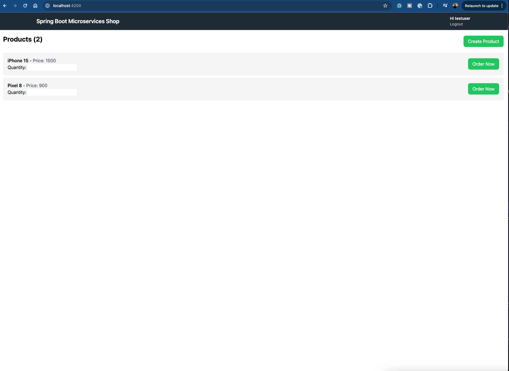
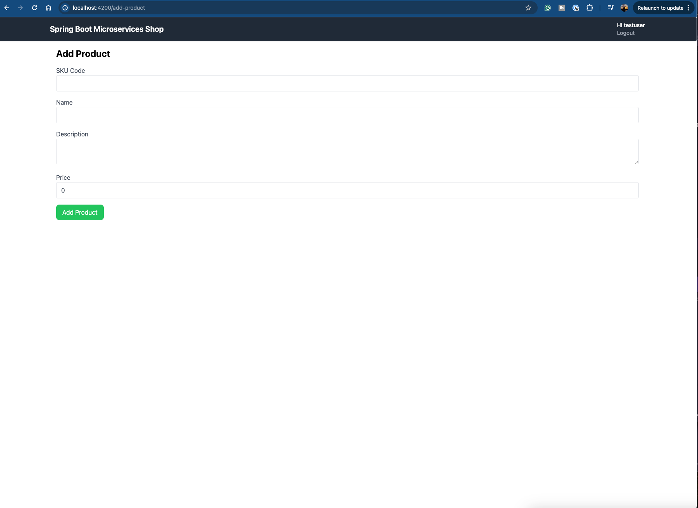

# MicroservicesShopFrontend

This project was generated with [Angular CLI](https://github.com/angular/angular-cli) version 18.0.2.

## Development server

Run `ng serve` for a dev server. Navigate to `http://localhost:4200/`. The application will automatically reload if you change any of the source files.

## Screenshots

Home Page

Add Product page

Refer to the detailed guide to setup the application along with Keycloak - https://programmingtechie.com/2024/06/09/spring-boot-microservices-tutorial-part-7/
